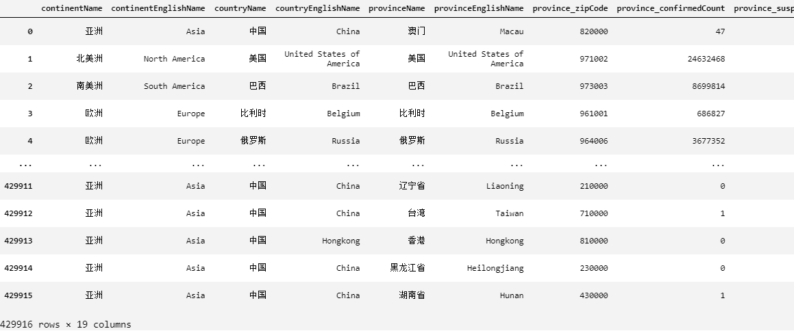
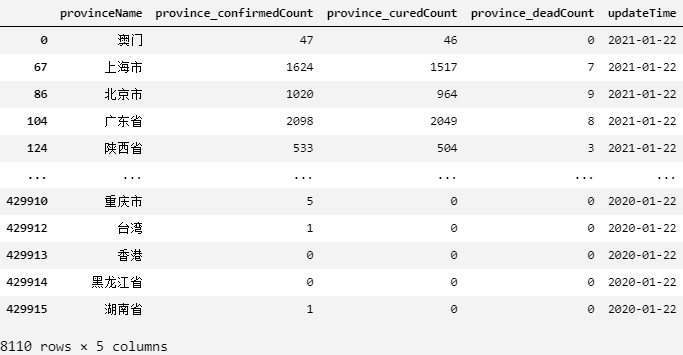
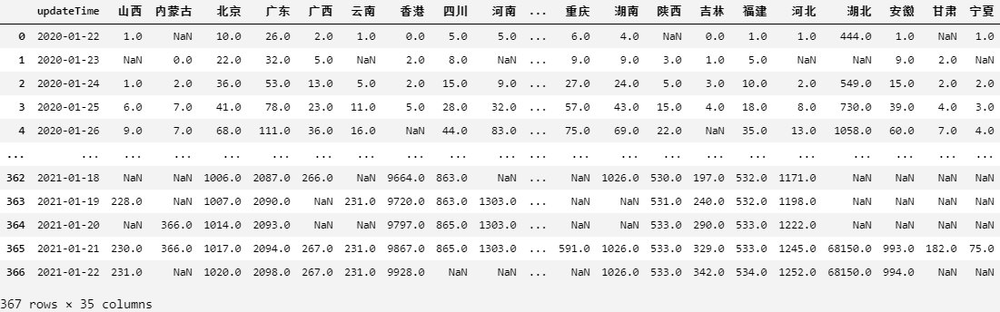
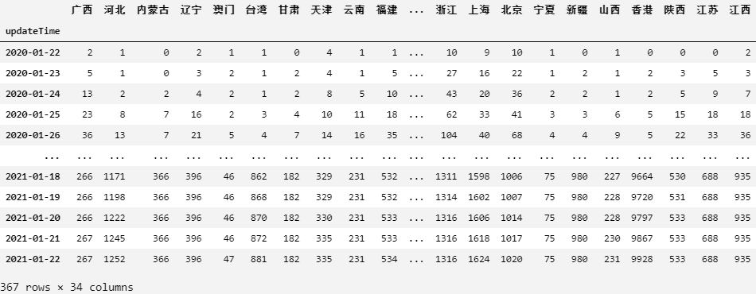
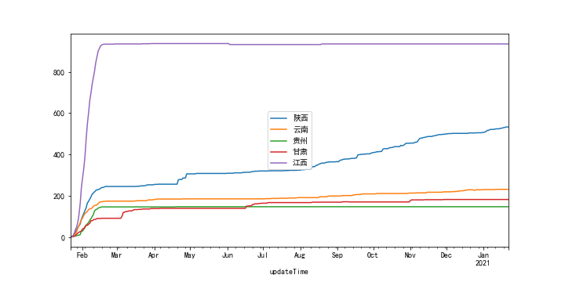
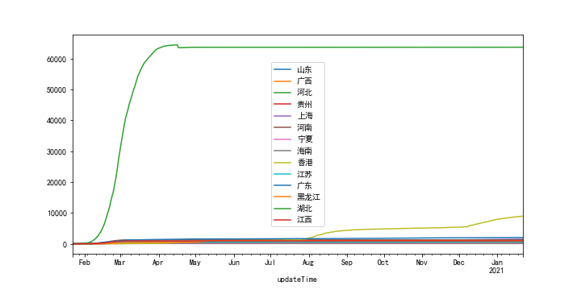
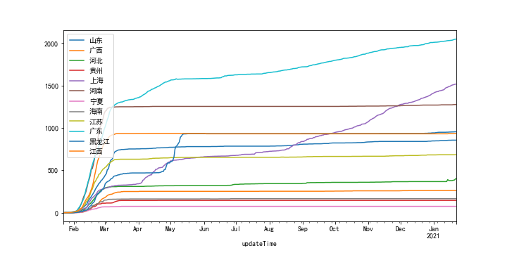
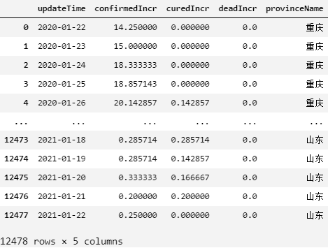
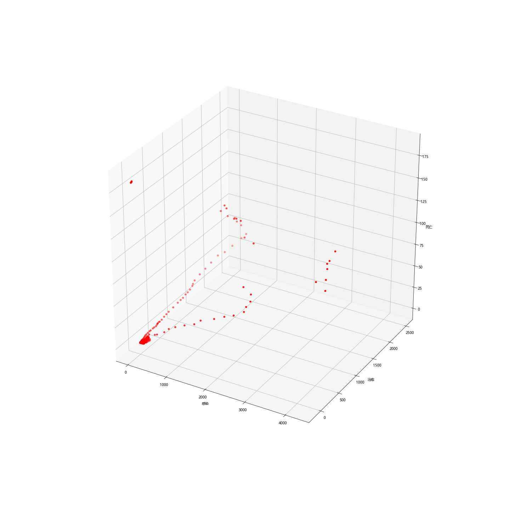
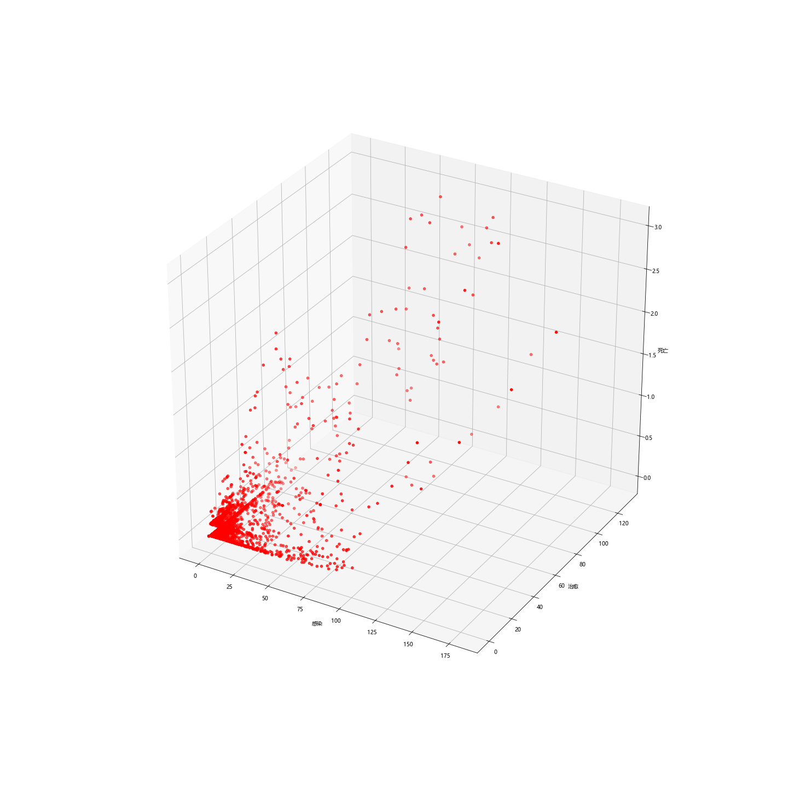

<div style="text-align:center">
	
    <br/><br/><br/><br/><br/>
	
    <br/><br/><br/><br/><br/>
    <font size="10" face="宋体" style="color: black">
        信&nbsp;息&nbsp;学&nbsp;院<br/>
        软件工程系
    </font>
    <br/><br/><br/>
    <font size="5" face="宋体" style="color: black">
    	《社交网络技术与应用》<br/>
        作业三 文本分类<br/><br/><br/>
    </font>
    <p>
        <b>实验题目</b>&nbsp;&nbsp;<u>文本分类</u>&nbsp;&nbsp;<b>报告编写<em>&</em>汇总</b>&nbsp;&nbsp;<u>陈泊霖</u><br/>
        <b>学号</b>&nbsp;&nbsp;<u>21620182203533</u>&nbsp;&nbsp;<b>姓名</b>&nbsp;&nbsp;<u>余嘉炜</u><br/>	
        <b>学号</b>&nbsp;&nbsp;<u>24320182203170</u>&nbsp;&nbsp;<b>姓名</b>&nbsp;&nbsp;<u>陈泊霖</u><br/>	
        <b>学号</b>&nbsp;&nbsp;<u>33920172204326</u>&nbsp;&nbsp;<b>姓名</b>&nbsp;&nbsp;<u>揣琪</u><br/>	
        <b>学号</b>&nbsp;&nbsp;<u>24320182203165</u>&nbsp;&nbsp;<b>姓名</b>&nbsp;&nbsp;<u>蔡心露</u><br/>	
        <b>学号</b>&nbsp;&nbsp;<u>24320182203160</u>&nbsp;&nbsp;<b>姓名</b>&nbsp;&nbsp;<u>奥玛·次尔友珍</u><br/>
    <p>
</div>
<p align="right"><font style="color: black; font-size: 10px">实验报告汇总编写：陈泊霖</font></p>
<style type="text/css">
	pre {font-size: 12px}
</style>

# 1. 总述

## 1.1 项目目的

本章实验的主要目的是掌握社交媒体文本挖掘系统的主要模块用到的方法，即词性标注、实体识别、聚类分析等。掌握如何使用华为云ModelArts Notebook上传数据、执行Python代码，掌握数据挖掘的一般建模流程。

## 1.2 项目要求

1. 爬取社交媒体数据
   1. 丁香园数据爬取
   2. 社交媒体网站数据爬取
2. 数据预处理与存储
   1. 丁香园数据预处理
   2. 社交媒体文本评论数据预处理
   3. 数据存储
3. 实现丁香园数据的分析与可视化
   1. 数据发展趋势变化分析
   2. 动态地图
   3. 数据分类和结果绘制
   4. 前端页面实现
4. 实现社交媒体评论的分析与可视化
   1. 词频统计和词云图
   2. 聚类分析及其结果图
   3. 情感分析及其结果图
   4. 前端页面实现
5. 报告和演示
   1. PPT
   2. 实验报告

## 1.3 项目分工

| 任务名称 | 任务描述 | 负责人 |
| -------- | -------- | ------ |
|          |          |        |
|          |          |        |
|          |          |        |

# 2. 数据爬取

## 2.1 丁香园数据爬取

代码：

```python
```

输出：

<pre></pre>
## 2.2 微博数据爬取

代码：

```python

```

输出：

<pre></pre>


# 3. 数据预处理和存储

数据源：采用从[丁香园2019新型冠状病毒疫情时间序列数据仓库](https://github.com/BlankerL/DXY-COVID-19-Data)。

文件见[DXYArea.csv](Z:\课业\大三下\社交网络技术与应用\大作业\DXYData)。

## 3.1 丁香园数据预处理

### 3.1.1 数据去重

##### 步骤1 环境导入和数据读取

代码：

```python
import pandas as pd
import datetime
data = pd.read_csv("DXYvisualize/DXYArea.csv")
data
```

输出：



##### 步骤2 数据选择和去重

由于源数据中存在其他国家（或地区）的疫情数据，故需要进行过滤；三种数据（累计确诊、累计治愈、累计死亡）需要分别存放在三个不同的表格内。

首先对countryName为"中国"的对应数据项进行选择和去重，并将时间四舍五入到天：

```python
data = data[data["countryName"] == "中国"]
data = data[data["provinceName"] != "中国"]
data = data[["provinceName", "province_confirmedCount", "province_curedCount" ,"province_deadCount", "updateTime"]]
data["updateTime"] = data["updateTime"].apply(
    lambda x: datetime.datetime.strptime(x.split()[0], "%Y-%m-%d"))
data = data.drop_duplicates()
data
```

输出：



提取省序列：

```python
provinceSet = set(data["provinceName"])
provinceSet
```

输出：

<pre>{'山西省', '内蒙古自治区', '北京市', '广东省', '广西壮族自治区', '云南省', '香港', '四川省', '河南省', '西藏自治区', '新疆维吾尔自治区', '青海省', '江西省', '天津市', '贵州省', '浙江省', '台湾', '上海市', '江苏省', '辽宁省', '海南省', '澳门', '黑龙江省', '山东省', '重庆市', '湖南省', '陕西省', '吉林省', '福建省', '河北省', '湖北省', '安徽省', '甘肃省', '宁夏回族自治区'}</pre>

提取时间序列：

```python
timeLine = list(set(data["updateTime"]))
timeLine.sort()
dateStart, dateEnd = timeLine[0], timeLine[-1]
timeLine = []
while dateStart <= dateEnd:
    timeLine.append(dateStart)
    dateStart += datetime.timedelta(days=1)
timeLine
```

输出：

<pre>[Timestamp('2020-01-22 00:00:00'),
 Timestamp('2020-01-23 00:00:00'),
 Timestamp('2020-01-24 00:00:00'),
 ...
 Timestamp('2021-01-21 00:00:00'),
 Timestamp('2021-01-22 00:00:00')]</pre>

分表（结果展示累计确诊）：

```python
confirmedData = pd.DataFrame(data=timeLine, columns=["updateTime"])
curedData = pd.DataFrame(data=timeLine, columns=["updateTime"])
deadData = pd.DataFrame(data=timeLine, columns=["updateTime"])

for provinceName in provinceSet:
    provinceData = data[data["provinceName"] == provinceName].copy()
    provinceData = provinceData.drop(columns=["provinceName"])
    pyechartsProvinceName = \ # 丁香园省名→pyechart省名
        provinceName[:3] \
        if (provinceName[:3]=="黑龙江"or provinceName[:3]=="内蒙古") \
        else provinceName[:2]
    provinceData.drop_duplicates(["updateTime"], keep="first", inplace=True)

    confirmedCol = provinceData[["updateTime", "province_confirmedCount"]].rename(columns={"province_confirmedCount":pyechartsProvinceName})
    curedCol = provinceData[["updateTime", "province_curedCount"]].rename(columns={"province_curedCount":pyechartsProvinceName})
    deadCol = provinceData[["updateTime", "province_deadCount"]].rename(columns={"province_deadCount":pyechartsProvinceName})
    
    # 左连接
    confirmedData = pd.merge(confirmedData, confirmedCol, on="updateTime", how="left")
    curedData = pd.merge(curedData, curedCol, on="updateTime", how="left")
    deadData = pd.merge(deadData, deadCol, on="updateTime", how="left")
confirmedData
```




### 3.1.2 数据清洗

#### 3.1.2.1 空值处理

``` python
def fillna(data: pd.DataFrame)->pd.DataFrame:
    data = data.fillna(method="pad")
    data = data.fillna(value="0")
    data = data.set_index('updateTime')
    data = data.astype('int')
    return data

confirmedData = fillna(confirmedData)
curedData = fillna(curedData)
deadData = fillna(deadData)
confirmedData
```

结果展示累计确诊：



#### 3.1.2.2 异常值处理

由于选取的三个时间序列数据都应随着时间而递增（可以认为已确诊不会变为未确诊，已治愈不会变为未治愈，已死亡不会变为未死亡），但是其中又存在着统计差异，所以我们认为比较小的数据值下降是可以接受的。

```python
import matplotlib.pyplot as plt
def isIncrease(data: pd.DataFrame)->pd.DataFrame:
    un_incr = list(filter(None,[
        key if value == False else None \
            for key,value in \
                data.apply(lambda x: x.is_monotonic).to_dict().items()]))
    data[un_incr].plot(figsize=(10,5))
    plt.savefig("pic.png")

isIncrease(confirmedData)
# isIncrease(curedData)
# isIncrease(deadData)
```

输出（累计确诊）：



从图表上发现数据波动尚在接受范围内。

输出（累计治愈）：



湖北（绿色曲线）数据的下降是由[2020年4月17日数据修订](https://baijiahao.baidu.com/s?id=1664226403389467026&wfr=spider&for=pc)造成的。

为方便查看其它数据，去除湖北（绿色曲线）和香港（黄色曲线）数据后：



未见超出接受范围的数据异常值。

死亡数据没有出现异常值。

由于此次发现的数据异常值都为较微弱的数据波动或有明确原因，故不做数据异常值处理。

最后将数据存储为csv：

```python
confirmedData.to_csv("DXYvisualize/confirmedData.csv")
curedData.to_csv("DXYvisualize/curedData.csv")
deadData.to_csv("DXYvisualize/deadData.csv")
```

### 3.1.3 特征工程

由于源数据（累计确诊、累计治愈、累计死亡）并不能体现出疫情发展的程度，不符合特征工程的需求，故在进行特征工程前，需要对源数据进行处理。

##### 步骤1 数据读取

```python
confirmedData = pd.read_csv("DXYvisualize/confirmedData.csv", index_col=0)
curedData = pd.read_csv("DXYvisualize/curedData.csv", index_col=0)
deadData = pd.read_csv("DXYvisualize/deadData.csv", index_col=0)
```

##### 步骤2 数据处理

首先对数据进行差值计算，求出增量，即求出新增确诊、新增治愈、新增死亡：

```python
def getIncr(data: pd.DataFrame)->pd.DataFrame:
    incr = data.diff()
    incr.iloc[0] = data.iloc[0]
    return incr

confirmedIncr = getIncr(confirmedData)
curedIncr = getIncr(curedData)
deadIncr = getIncr(deadData)
```

接着使用rolling将数据进行平滑，减小波动对结果的影响：

```python
def getRolling(data: pd.DataFrame)->pd.DataFrame:
    return data.rolling(7, center=True, min_periods=0).mean()

confirmedIncrRolling = getRolling(confirmedIncr)
curedIncrRolling = getRolling(curedIncr)
deadIncrRolling = getRolling(deadIncr)
```

将结果按时间和省份作为索引，合并到一张表中：

```python
totalData = pd.DataFrame(columns=["updateTime","confirmedIncr","curedIncr","deadIncr","provinceName"])
for province in confirmedData.columns.values:
    provinceData = pd.DataFrame(data = confirmedData.index,columns=["updateTime"])
    # print( confirmedIncrRolling[province])
    provinceData.insert(1, 'provinceName', [province]*len(confirmedData.index))
    provinceData.insert(2, 'confirmedIncr', confirmedIncrRolling[province].values)
    provinceData.insert(3, 'curedIncr', curedIncrRolling[province].values)
    provinceData.insert(4, 'deadIncr', deadIncrRolling[province].values)
    totalData = pd.concat([totalData, provinceData])
totalData = totalData.reset_index(drop=True)
totalData
```

输出：



最后将确诊、治愈、死亡的增量作为三个维度，进行数据可视化，以查看数据特征：

```python
import matplotlib.pyplot as plt
from mpl_toolkits.mplot3d import Axes3D

plt.figure(figsize=(20,20))
ax = plt.subplot(projection="3d")
ax.set_title("")
ax.scatter(totalData["confirmedIncr"],totalData["curedIncr"],totalData["deadIncr"],c='r')
ax.set_xlabel("感染")
ax.set_ylabel("治愈")
ax.set_zlabel("死亡")
plt.savefig("3D.png")
```

输出（右图手动去除了湖北的数据）：

<table><tr>
    <td></td>
    <td></td>
</tr></table>

##### 步骤3 特征选择


##### 步骤4 降维处理

## 3.2 微博数据预处理

代码：

```python

```

输出：

<pre></pre>

## 3.3 数据存储

### 3.3.1 丁香园数据存储

代码：

```python

```

输出：

<pre>
</pre>
### 3.3.2 社交媒体数据存储


# 4. 丁香园数据分析与可视化

## 4.1 数据发展趋势变化分析

##### 步骤1 数据读取


## 4.2 动态地图


## 4.3 数据分类和结果绘制


## 4.4 前端页面实现


# 5. 社交媒体数据分析与可视化


